<!-- hero: monochrome ASCII portrait (types in) beside a neofetch-style info
     panel. regenerate portrait: python scripts/prep_photo.py <photo> &&
     python scripts/make_ascii_svg.py ; info panel: python scripts/make_info_card.py -->

<!-- animated contribution graph: real data, boxes reveal cell by cell
     (regenerated daily by .github/workflows/update-profile-art.yml) -->

<h3><code>aayush@github ~ $ ./contributions.sh</code></h3>

 
 

<h3><code>aayush@github ~ $ whoami</code></h3>

<table>
<tr>
<td valign="top"></td>
<td valign="top"></td>
</tr>
</table>

 
 

<h3><code>aayush@github ~ $ cat about_me.txt</code></h3>

🔭 I’m currently working on Web Development, Frontend Development, AIML, Data Analysis, Data Structures 
🤝 I’m looking for help with backend development, collaboration for new projects 
🌱 I’m currently learning Web development, machine learning and data structures 
💬 Ask me about AI, robotics, webdev 
⚡ <b>Fun fact:</b> I have a patent published on Wearable ergonomics system for accident prevention with haptic alerts and alert methods. And also a National Hackathon Winner.

 
 

<h3><code>aayush@github ~ $ ls tech_stack/</code></h3>

     
     
     
    
    
     
    
   

 
 

<h3><code>aayush@github ~ $ ./github_stats.sh</code></h3>

 

 
 

 
 

<h3><code>aayush@github ~ $ ./links.sh</code></h3>

<b>Student · Developer · AI Builder</b>

 
 

